# Design resources

Before you go any further, make sure that you completed the [setup guide](https://github.com/N17R/setup).

If you did everything correctly, you should have [Sketch](https://www.sketchapp.com/) and [Iconjar](http://geticonjar.com/) apps installed. If not, please go back and review or call a mentor.

## Icons

To make life easier for you, we put together a collection of cool line icons that you can use in your designs. The icon sets are in the form of iconjars, so you will need the app to use them. To download and install the sets, type the following command in your terminal:

```bash
$ curl -fsSL https://raw.githubusercontent.com/N17R/design-resources/master/install-icons.sh | sh
```

When the script is finished, you should see about two dozen icon sets in your Iconjar left sidebar.

In most cases, you will also need to use external resources to find the icons you need. We recommend [FlatIcon](http://www.flaticon.com/). The most convenient way to use it is to download their free app [from Mac App Store](https://itunes.apple.com/app/flaticon/id1042588206).

We also suggest you to bring together 3 to 4 fellow designers and purchase a license to use an expanded collection of premium icons from [Streamline](http://www.streamlineicons.com/) or [IconsMind](https://www.iconsmind.com/pricing/).

## Sketch plugins

We recommend you to download and install these Sketch plugins.

### 1. [Craft](https://labs.invisionapp.com/craft)

Just enter your email in the provided form, follow the link in the received email, and install the plugin with the downloaded installer.

### 2. [Zeplin](https://zeplin.io/)

First, [sign up](https://app.zeplin.io/register.html) on their website. Then download their mac app by typing the following command in your terminal:

```bash
$ brew cask install --appdir="/Applications" zeplin
```

The Sketch plugin will be installed when you first launch the app.

### 3. [Fluid](https://github.com/matt-curtis/Fluid-for-Sketch)

Download the [`.zip`](https://github.com/matt-curtis/Fluid-for-Sketch/releases/download/v1.7.3/Fluid.sketchplugin.zip), extract it, and open the `.sketchplugin` file.

## UI Kits

Here are some good free Sketch UI Kits we collected, that you can use to help speed up your design process.

---

First of all, let's start with wireframing kits. Wireframes are good for communicating your ideas at various stages of the design process and help facilitate the conversations and feedback that are required to move the project to its next phase.

### Bloc by Thomas Budiman

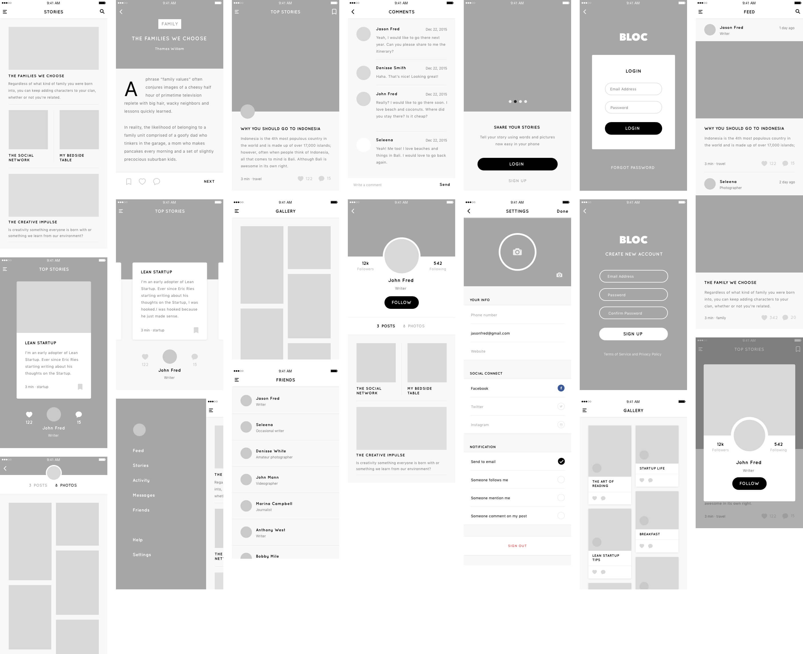

Download it [here](https://drive.google.com/open?id=0B8DNb95GQj5KR3c3YVZMVkVkdFk).

### Uber Wireframe Kit by John Francis

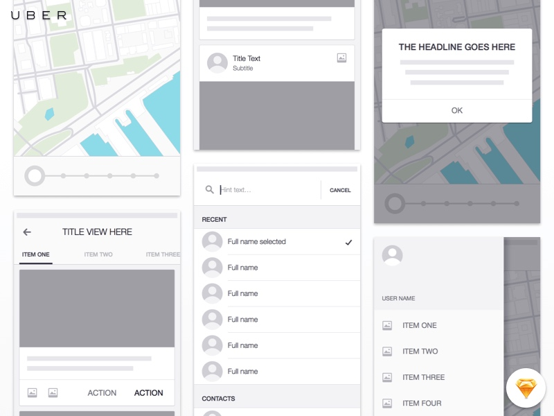

Download it [here](https://drive.google.com/open?id=0B8DNb95GQj5KdzlJRUJLWEpWRk0).

### Moon Wireframe Kit by George Frigo

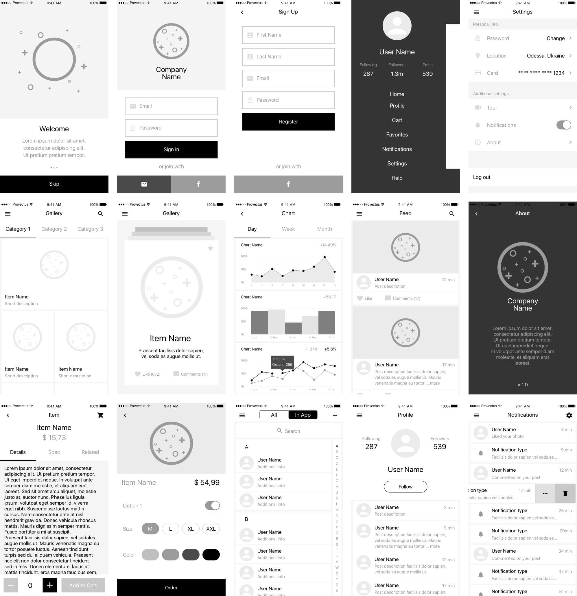

Download it [here](https://drive.google.com/open?id=0B8DNb95GQj5Kd1Q2NmJXRVprZmc).

### Flow iOS Wireframe Kit by Vineet Kumar

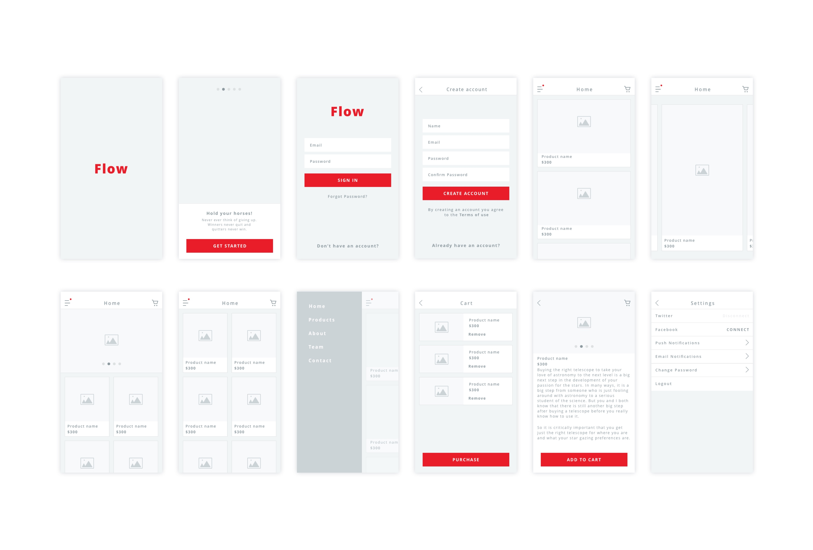

Download it [here](https://drive.google.com/open?id=0B8DNb95GQj5KcGZvX0lFVFUxVWM).

---

Following kits feature elements that you can use directly in your designs.

### Avital UI Kit by Yaroslav Zaytsev

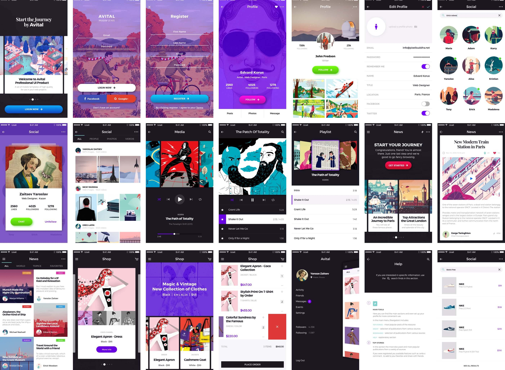

Download it [here](https://drive.google.com/open?id=0B8DNb95GQj5KNTJOdFJsM2ZoOG8).

### E-commerce UI by Five Agency

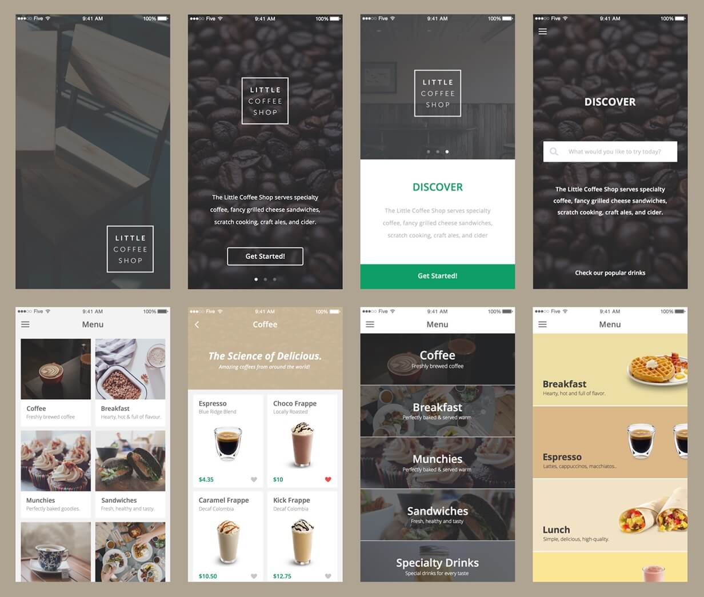

Download it [here](https://drive.google.com/open?id=0B8DNb95GQj5KcWtFMEVrTmxZVHc).

### Good Barber Open UI Kit


Download it [here](https://drive.google.com/open?id=0B8DNb95GQj5KZC1yUkl3Q0txOTQ).

### Ink UI Kit Free by Great Simple

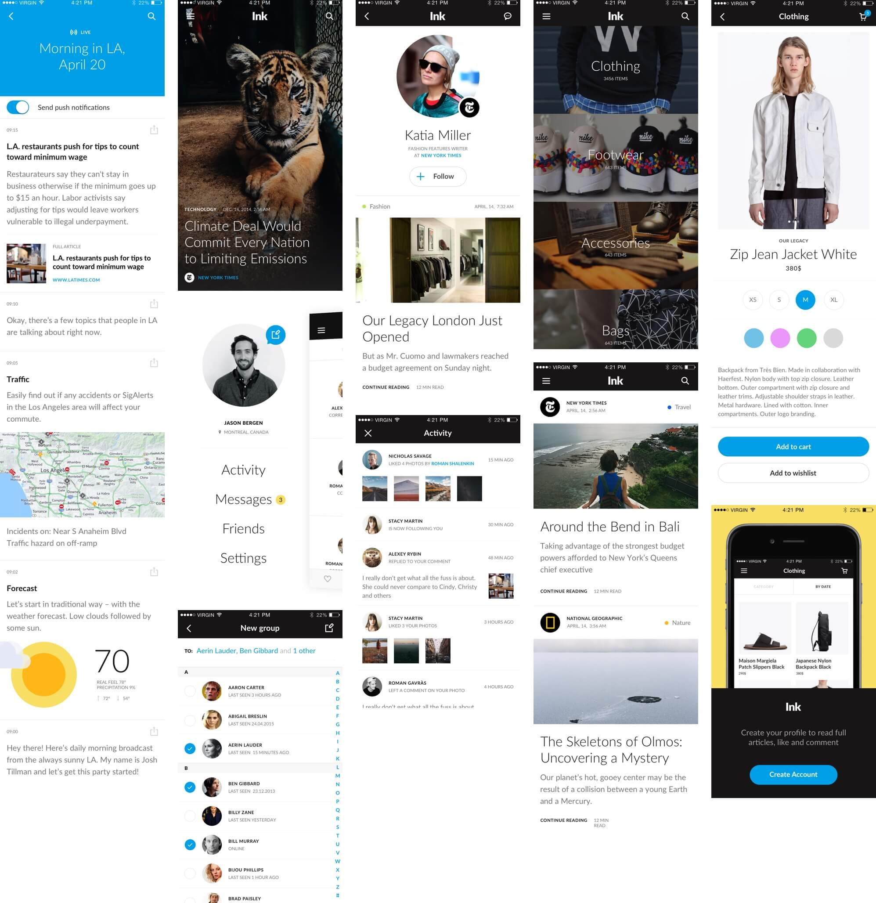

Download it [here](https://drive.google.com/open?id=0B8DNb95GQj5KQUR0ZWNUSTBFOTg).

### Medium by Andrea Montini

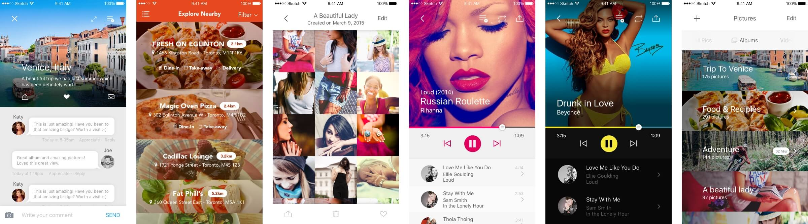

Download it [here](https://drive.google.com/open?id=0B8DNb95GQj5KZm9GY2V3OVhHMFU).

### Tilt UI Kit by Jared Lodwick


Download it [here](https://drive.google.com/open?id=0B8DNb95GQj5KOEVqd0FOdWRtamM).

### News App UI Kit by Konrad Marzec


Download it [here](https://drive.google.com/open?id=0B8DNb95GQj5KQ3hERTBWMlJ0MDg).

### NOW by Invision


Download it [here](https://drive.google.com/open?id=0B8DNb95GQj5KTWlHbDh1cUMwdzg).

### DO by Invision


Download it [here](https://drive.google.com/open?id=0B8DNb95GQj5KeGNXM0p1ejk4NTg).

### Phoenix UI Vol 1 by Adrian Chiran


Download it [here](https://drive.google.com/open?id=0B8DNb95GQj5KbExlcUVxMGx4R3c).

### Resnap UI by Ales Nesetril

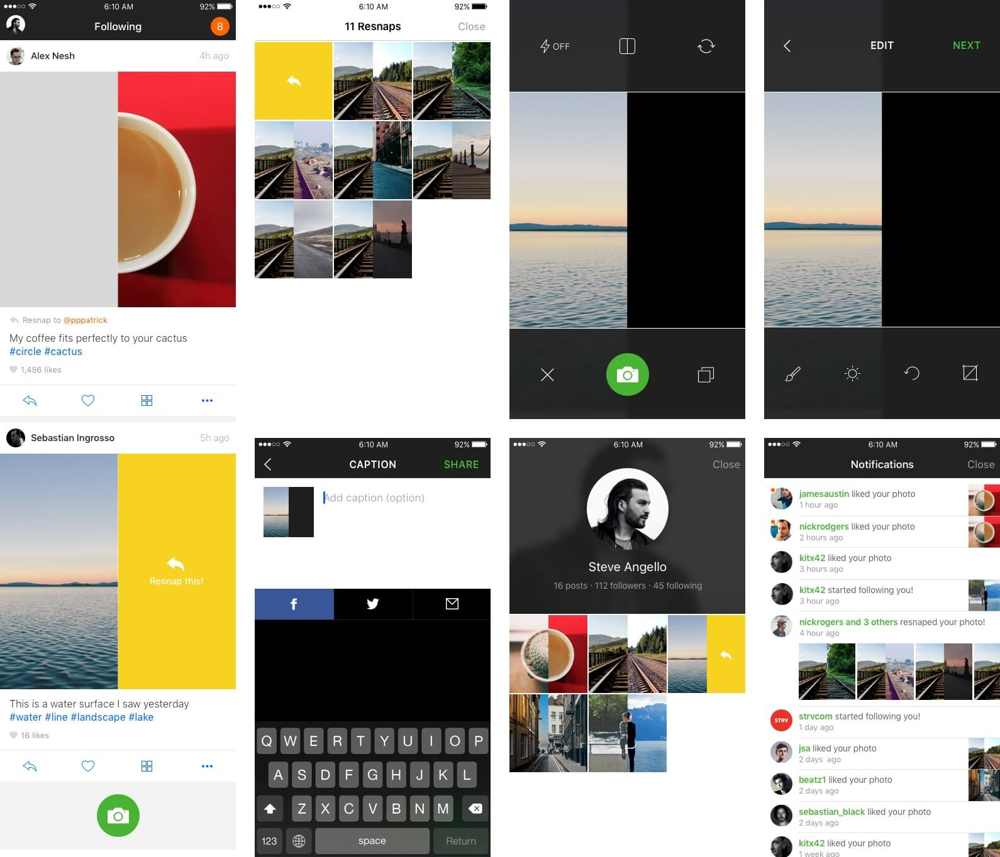

Download it [here](https://drive.google.com/open?id=0B8DNb95GQj5KZTQtNUJQalpUX2s).

### Routes UI Kit by Beans

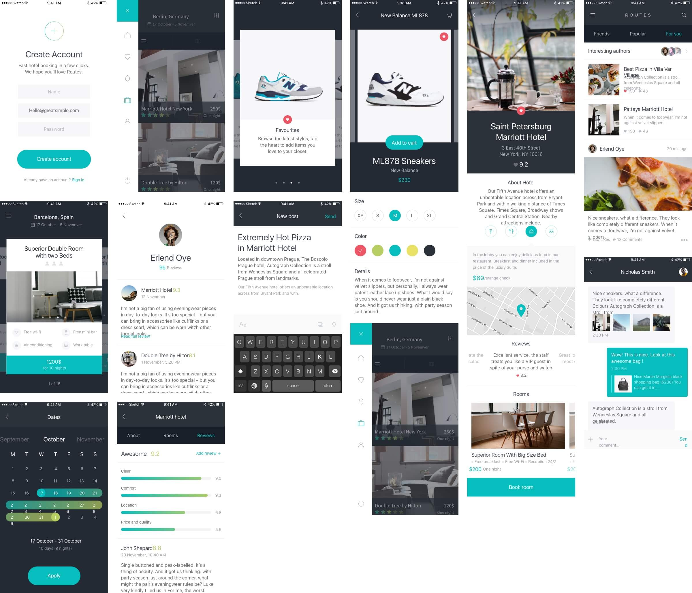

Download it [here](https://drive.google.com/open?id=0B8DNb95GQj5KeGNXM0p1ejk4NTg).

### Sign In Project by Jardson Almeida


Download it [here](https://drive.google.com/open?id=0B8DNb95GQj5KRk9ENnNZX1FMX0U).

### TETHR UI Kit by Invision


Download it [here](https://drive.google.com/open?id=0B8DNb95GQj5KRHhWa0FfS3hXSFk).

### Travel UI by Five Agency


Download it [here](https://drive.google.com/open?id=0B8DNb95GQj5KakpBNzJsT29nazA).

### Pantry Zen Grocery App Concept by Adhrian Putra

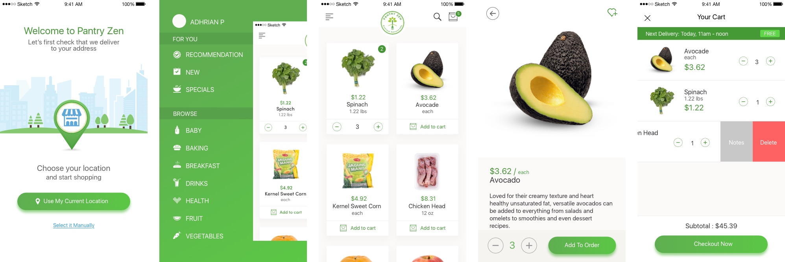

Download it [here](https://drive.google.com/open?id=0B8DNb95GQj5KMWxnQU9YdG5oVjQ).

---

There are of course more Sketch resources available out there. If you're interested, you can bookmark these great websites:
- [Sketch App Sources](http://www.sketchappsources.com/tag/ios.html)
- [FreebiesBug](http://freebiesbug.com/sketch-freebies/)
- [Sketch Repo](https://sketchrepo.com/tag/free-sketch-ui-kits/)

And if you're willing to spend some money, the best place to get excellent design resources for Sketch is [UI8](https://ui8.net/).
